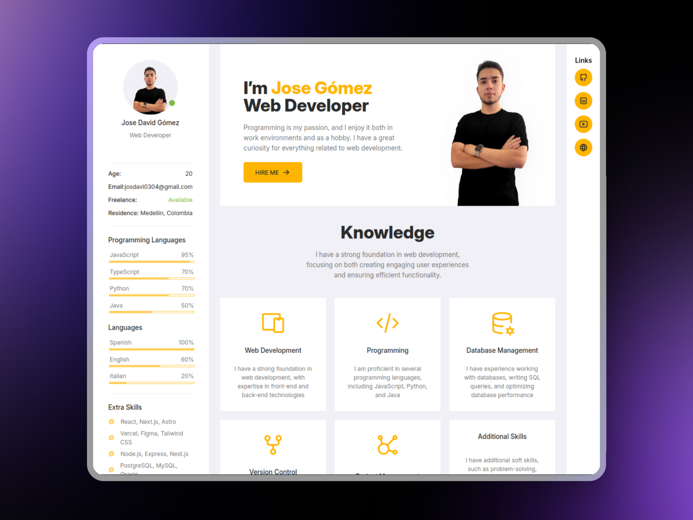

# Portafolio de Jose Gómez

Visita el portafolio en [jose-gomez-portfolio.vercel.app](https://jose-gomez-portfolio.vercel.app/) 🌐✨

<div align="center">
  
</div>

Desarrollado por [Jose Gómez](https://github.com/josegomez)

## Descripción

Este proyecto consiste en el desarrollo de mi portafolio personal, en el cual se presentan mis habilidades, proyectos y datos de contacto. La página principal cuenta con una sección de presentación, conocimientos, habilidades y enlaces de contacto. Además, se incluye una sección de proyectos en la que se muestran los proyectos más destacados.

Este portafolio fue desarrollado con Next.js, TypeScript y Tailwind CSS, además incluye iconos de la librería de [@Tabler/Icons](https://tabler.io/icons/).

## Herramientas utilizadas

  

  

  

## Instalación

1. Clona el repositorio

```bash
git clone https://github.com/josegmez/jose-gomez-portfolio.git jose-gomez-portfolio
```

2. Cambia al directorio del proyecto

```bash
cd jose-gomez-portfolio
```

3. Instala las dependencias

```bash
npm install
```

4. Inicia el servidor de desarrollo

```bash
npm run dev
```

5. Abre tu navegador y ve a `http://localhost:3000`

